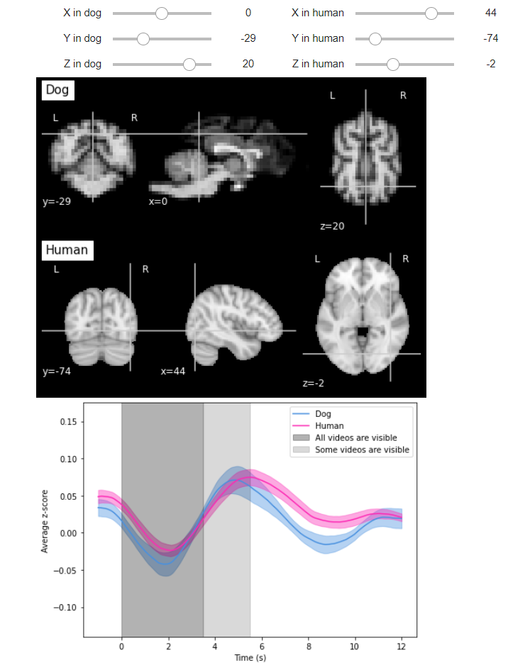

# Hemodynamic response function to visual stimuli

In order to visually compare the BOLD response in dogs and humans, I calculated an average brain response across all participants. 
The final result can be visualized in an interactive plot here:

This is screenshoot of the interactive plot.

First, I calculated the minimal time step possible based on the onsets of the videos and moment in which the image was acquired by the scanner [using this script](gettingTimeStep.m). Next, I obtained the average brain response for each participant on every voxel [using this script](calculateHRFByParticipant.m). Finally, I calculated the average response across participants [with this script](gettingBOLD_average.m). I saved the results in my google drive and created public links so they can be visualized in the Colab notebook above.

